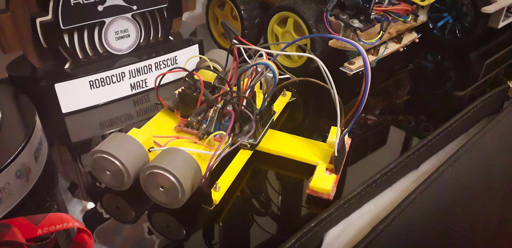

# GAIROS - LineFollower 2018
###### Tiny 4-wheeled robot designed to compete at [Robocore Winter Challenge XIV](https://www.robocore.net/eventos/wc14), in the Junior Line Follower category. The event was held in São Caetano do Sul, Brazil.

## What is a Speed Line Follower?

In this competition, teams must build and program an autonomous robot to follow a closed-loop circuit consisting of a white line printed on a black plane, in the shortest time possible, and stop on the starting point by itself. After three days of competition, the final ranks are determined by the shortest recorded time of each robot, across all rounds. 

Video Playlist: https://www.youtube.com/playlist?list=PLTt2NcjDh03R7uwRPFeTJ_-Co9ihL0fQv

## Repository Contents

| Folder                      | What´s Inside                                                | Key File             |
| --------------------------- | ------------------------------------------------------------ | -------------------- |
| São Caetano do Sul / GAIROS | C++ Software that runs on the robot´s Arduino Nano microcontroller, including various debugging scripts | GAIROS.ino           |
| São Caetano do Sul / models | 3D modelling of the robot I have made using AutoCAD 2017, in order to 3D print the chassis and account for mechanical aspects | GAIROS 2.dwg         |
| Marcelo_Motor_Sensor_Branca | Simple PID control programming exercise                      | (.ino file)          |
| Linha_Preta 2018            | Scripts I made to test a PID controlling algorithm to follow the line, on a simpler, temporary robot available at my school. [VIDEO](https://www.youtube.com/watch?v=4fgVYXDvc8w) | PID_8_NOVOFELIPE.ino |
| WCXV                        | Concept modelling of a new robot made after the competition, using ideal components. The new robot would utilize a more powerfull processor, external gear reductors, and a sensor PCB | Drawing1.dwg         |
| Rules                       | Official rules of the category published by Robocore, as of 2018 | (.pdf file)          |

## Robot Hardware

The robot consists of:

1. 1x PLA 3D-printed chassis body
2. 1x Arduino Nano microcontroller board
3. 1x L298n dual motor driver module
4. 4x Pololu micro metal 3000RPM DC motors (6V HP, 10:1 gear reduction)
5. 4x StickyMAX S30 32mm silicone rubber wheels
6. 1x 8-sensor QRE reflectance module board
7. 2x Standalone QRE reflectance modules
8. Small 12V LiPo battery (not seen in picture)

## Where to Find Me:

* [Telegram Contact 🔵](https://t.me/mekhyw)
* [YouTube Channel 🔴](https://www.youtube.com/channel/UC3__YPhMGjytXUqRUmriQ8A?view_as=subscriber)
* [Twitter Page 🐦](https://twitter.com/MekhyW)
* [Instagram Page 📸](https://www.instagram.com/mekhy_w/)

